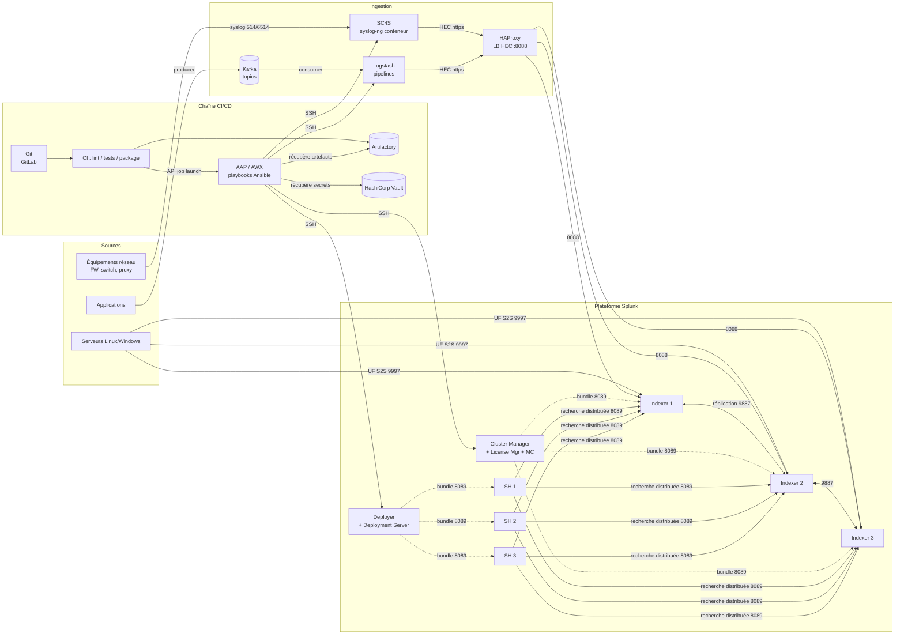

# Splunk industrialisé (CI/CD · Ansible/AAP · SC4S · Kafka · Logstash · Vault · Artifactory)

Kit de préparation **en 2 jours** pour une mission de renfort Splunk / DevOps :
comprendre l'architecture, savoir comment chaque composant parle aux autres,
et l'avoir **monté soi-même sur un cluster Proxmox**.

> Tu ne connais rien à Splunk ? Lis dans cet ordre, puis déroule le lab.

| # | Document | Contenu | Temps |
|---|----------|---------|-------|
| 0 | [docs/00-planning-2-jours.md](docs/00-planning-2-jours.md) | Le programme heure par heure | 5 min |
| 1 | [docs/01-architecture-globale.md](docs/01-architecture-globale.md) | **La vue d'ensemble de la mission** + flux + matrice des ports | 1 h |
| 2 | [docs/02-splunk-fondamentaux.md](docs/02-splunk-fondamentaux.md) | Splunk de zéro : composants, index, buckets, .conf, SPL | 2 h |
| 3 | [docs/03-splunk-clustering.md](docs/03-splunk-clustering.md) | Indexer cluster, Search Head Cluster, bundles, RF/SF | 2 h |
| 4 | [docs/04-ingestion-sc4s-kafka-logstash.md](docs/04-ingestion-sc4s-kafka-logstash.md) | Chaîne d'ingestion Syslog → SC4S / Kafka → Logstash → HEC | 1 h 30 |
| 5 | [docs/05-cicd-aap-artifactory-vault.md](docs/05-cicd-aap-artifactory-vault.md) | Git → CI → Artifactory → AAP → Splunk, secrets Vault | 1 h 30 |
| 6 | [docs/06-mco-mcs-exploitation.md](docs/06-mco-mcs-exploitation.md) | Supervision, incidents, mises à jour, runbooks | 1 h |
| 7 | [docs/07-lab-proxmox.md](docs/07-lab-proxmox.md) | **Montage du lab** pas à pas | ~1 jour |
| 8 | [docs/08-questions-entretien.md](docs/08-questions-entretien.md) | 60+ questions / réponses d'entretien | 1 h |
| 9 | [docs/09-aide-memoire.md](docs/09-aide-memoire.md) | Cheat-sheet commandes CLI, SPL, chemins, ports | à imprimer |
| 10 | [docs/10-modele-DAT.md](docs/10-modele-DAT.md) | Trame de DAT + procédure d'exploitation | 20 min |

## Arborescence du dépôt

```
.
├── docs/                    # Cours + préparation entretien
├── ansible/                 # "Industrialisation" : tout le lab est déployé par Ansible
│   ├── ansible.cfg
│   ├── inventories/lab/     # Inventaire Proxmox + variables (group_vars)
│   ├── playbooks/           # site.yml, déploiement bundles, rolling upgrade, MCO...
│   └── roles/               # splunk_common, cluster_manager, indexer, shc, sc4s, logstash...
├── splunk-apps/             # "Configuration as code" : les apps Splunk versionnées
│   ├── manager-apps/        #   -> poussées aux indexeurs par le Cluster Manager
│   ├── shcluster-apps/      #   -> poussées aux Search Heads par le Deployer
│   └── deployment-apps/     #   -> poussées aux forwarders par le Deployment Server
├── ingestion/               # SC4S, Kafka, Logstash, HAProxy (LB HEC)
├── cicd/                    # Pipeline GitLab CI + objets AAP/AWX (config as code)
└── tools/                   # Générateurs de logs de test, scripts de vérification
```

## L'architecture en une image



Démarrage rapide du lab : voir [docs/07-lab-proxmox.md](docs/07-lab-proxmox.md).
