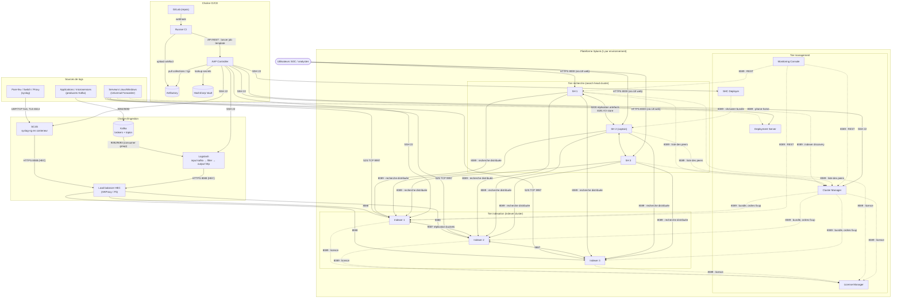
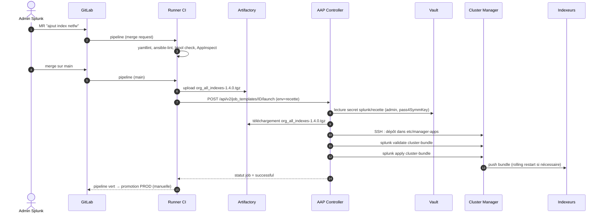

# 01 — Architecture globale de la mission

Ce document est **le plus important** : il décrit tous les composants, leur rôle, et
**comment ils communiquent**. Si tu ne dois lire qu'un document, c'est celui-ci.

---

## 1. Les 4 grands blocs

La mission se découpe en 4 blocs qui correspondent exactement aux 4 tâches de la fiche :

| Bloc | Tâche de la fiche | Composants |
|---|---|---|
| **A. Plateforme Splunk** | « Installation et configuration de plusieurs environnements Splunk » | Cluster Manager, Indexeurs, Search Heads (SHC), Deployer, Deployment Server, License Manager, Monitoring Console, Heavy Forwarders |
| **B. Ingestion** | « Chaîne d'ingestion de logs via SC4S et Logstash » | Sources syslog, SC4S, Kafka, Logstash, Load balancer HEC, Universal Forwarders |
| **C. CI/CD & automatisation** | « Industrialisation avec Ansible » + « via une chaîne CI/CD » | Git (GitLab), runners CI, Artifactory, AAP (Ansible Automation Platform), HashiCorp Vault |
| **D. Exploitation** | « MCO/MCS de la plateforme, de la chaîne CI/CD et des pipelines Logstash » | Monitoring Console, alertes, runbooks, playbooks de maintenance |

« **Plusieurs environnements** » = typiquement **DEV → RECETTE (ou PREPROD) → PROD**, chacun
étant un jeu complet (cluster + SHC). Le même code (playbooks + apps) est déployé partout,
seules les **variables d'inventaire** changent. C'est tout l'intérêt de l'industrialisation.

---

## 2. Schéma complet des flux

---

## 3. Chaque composant en 3 lignes

### Plateforme Splunk
| Composant | Rôle | Analogie |
|---|---|---|
| **Indexer (peer)** | Reçoit les données, les parse, les écrit sur disque en *buckets*, répond aux recherches. | Le disque + moteur de la base de données |
| **Cluster Manager (CM)** (ex-*Master Node*) | Pilote le cluster d'indexeurs : sait où sont les copies de chaque bucket, ordonne les réplications, distribue la conf commune (*configuration bundle*). **Ne stocke pas de données.** | Le chef d'orchestre |
| **Search Head (SH)** | Interface web (8000) + moteur de recherche : découpe la recherche, l'envoie aux indexeurs (*map*), fusionne les résultats (*reduce*). | Le « front » SQL |
| **Search Head Cluster (SHC)** | ≥ 3 SH qui partagent apps, recherches sauvegardées, KV store. Un **captain** élu (protocole Raft) planifie les recherches et réplique les artefacts. | Cluster actif/actif de front-ends |
| **Deployer** | Pousse les apps et la conf vers les membres du SHC (`etc/shcluster/apps`). N'est **pas** membre du SHC. | CM du SHC, mais uniquement pour la conf |
| **Deployment Server (DS)** | Distribue des apps aux **forwarders** (et HF) selon des *server classes*. Les clients l'interrogent périodiquement (*phone home*). | Un « GPO » pour agents |
| **License Manager (LM)** | Centralise la licence (volume GB/jour indexé). Tous les nœuds sont *license peers*. | Compteur |
| **Monitoring Console (MC)** | App Splunk qui supervise toute la plateforme (santé indexation, recherche, ressources, licences). | Grafana intégré |
| **Universal Forwarder (UF)** | Agent léger sur les serveurs, lit fichiers/journaux, envoie en S2S (9997). Pas de parsing. | Filebeat |
| **Heavy Forwarder (HF)** | Splunk complet qui *forwarde* : parse, filtre, route, héberge des add-ons de collecte API (DB Connect, cloud...). | Logstash « à la Splunk » |

### Ingestion
| Composant | Rôle |
|---|---|
| **Syslog** | Protocole standard (RFC 3164 / 5424) des équipements réseau/sécurité. UDP 514 (perte possible), TCP 514/601, TLS 6514. |
| **SC4S** (Splunk Connect for Syslog) | syslog-ng packagé par Splunk en conteneur (podman/docker). Reconnaît automatiquement des centaines de produits (Palo Alto, Fortinet, Cisco...), met le bon **sourcetype** et **index**, envoie en **HEC**. Bufferise sur disque si Splunk est indisponible. |
| **Kafka** | Bus de messages distribué. Les producteurs écrivent dans des *topics* (partitionnés, répliqués), les consommateurs lisent à leur rythme (*offsets*). Rôle : **tampon, découplage, multi-destinations** (Splunk + datalake + ...). |
| **Logstash** | ETL de logs (Elastic). *Pipelines* `input → filter → output`. Ici : `input kafka` → `filter` (grok, mutate, json, date...) → `output http` vers HEC. |
| **Load balancer HEC** | Répartit le HTTP Event Collector sur les indexeurs (ou HF), gère le health-check (`/services/collector/health`). |

### CI/CD et automatisation
| Composant | Rôle |
|---|---|
| **Git (GitLab/Bitbucket)** | Source unique de vérité : playbooks, inventaires, apps Splunk, pipelines Logstash, conf SC4S. |
| **CI (GitLab CI / Jenkins)** | À chaque commit : lint (`ansible-lint`, `yamllint`), validation Splunk (AppInspect, `btool check`), packaging `.tgz`, publication dans Artifactory, puis déclenchement AAP. |
| **Artifactory** | Dépôt d'artefacts : binaires Splunk/UF, apps packagées versionnées, collections Ansible, images conteneur SC4S/Logstash (registry Docker), miroir PyPI/Galaxy. Indispensable si les serveurs **n'ont pas Internet**. |
| **AAP** (Ansible Automation Platform, version Red Hat d'AWX) | Exécute les playbooks de façon centralisée, avec RBAC, inventaires, *credentials*, *job templates*, *workflows* (enchaînements), planification, API REST, logs d'audit. |
| **HashiCorp Vault** | Coffre à secrets : mots de passe admin Splunk, `pass4SymmKey` des clusters, tokens HEC, certificats (moteur PKI), clés SSH. AAP et Ansible le consultent au moment de l'exécution. |

---

## 4. Les flux, un par un (qui → qui, port, sens, contenu)

### 4.1 Matrice des ports (à connaître par cœur)

| Port | Protocole | De → Vers | Usage |
|---:|---|---|---|
| **8000** | HTTPS | Utilisateurs → SH | Splunk Web |
| **8089** | HTTPS (REST) | Tout le monde ↔ tout le monde | **splunkd management port** : API REST, communication CM↔peers, SH→indexeurs (recherche), DS↔clients, LM↔peers, Deployer→SHC |
| **9997** | TCP (S2S) | Forwarders → Indexeurs | Envoi de données « Splunk-to-Splunk » (souvent TLS : 9998) |
| **8088** | HTTPS | SC4S / Logstash / apps → LB → Indexeurs/HF | **HEC** (HTTP Event Collector) |
| **9887** | TCP | Indexeur ↔ Indexeur | Réplication des buckets (port choisi, 9887 par convention) |
| **9200** (exemple) | TCP | SH ↔ SH | Réplication des artefacts de recherche du SHC (port choisi) |
| **8191** | TCP | SH ↔ SH | **KV store** (MongoDB) |
| **8065** | local | — | App server Python (local seulement) |
| **514** UDP/TCP, **601**, **6514** TLS | Syslog | Équipements → SC4S | Réception syslog |
| **9092** / **9093** (TLS) | Kafka | Producteurs/Logstash → Brokers | Kafka |
| **9093/9094** (KRaft controller) | Kafka | Broker ↔ Controller | Quorum KRaft (remplace Zookeeper 2181) |
| **9600** | HTTP | Supervision → Logstash | API de monitoring Logstash |
| **8200** | HTTPS | AAP/Ansible → Vault | API Vault |
| **8081/8082** | HTTPS | CI/AAP → Artifactory | API/UI Artifactory |
| **443** | HTTPS | CI → AAP | API AAP (lancement de jobs) |
| **22** | SSH | AAP → toutes les VM | Exécution des playbooks |

### 4.2 Flux de données (« data plane »)

**F1 — Syslog réseau** : `Firewall ─UDP/TCP 514─▶ SC4S ─HEC 8088─▶ LB ─▶ Indexeurs`
- SC4S parse l'en-tête syslog, identifie le vendeur (par port dédié, par *filtre* sur le message ou par table `vendor_product_by_source`), fixe `index=netfw`, `sourcetype=pan:traffic` par ex.
- Envoi HEC en batch, **acknowledgement** optionnel, file disque si Splunk ne répond pas.

**F2 — Applications via Kafka** : `App ─produce─▶ Kafka topic ─consume─▶ Logstash ─HEC─▶ LB ─▶ Indexeurs`
- Logstash fait partie d'un **consumer group** : plusieurs instances Logstash se partagent les partitions (scalabilité horizontale).
- Si Splunk tombe, Logstash ralentit (back-pressure), **les messages restent dans Kafka** (rétention configurée) : aucune perte.

**F3 — Serveurs via Universal Forwarder** : `UF ─S2S 9997─▶ Indexeurs` (load-balancing automatique toutes les ~30 s entre indexeurs)
- La liste des indexeurs est obtenue par **indexer discovery** auprès du CM (8089) → pas besoin de maintenir la liste sur chaque UF.
- La configuration de l'UF (quoi lire, où envoyer) arrive du **Deployment Server** (phone-home 8089).

**F4 — Réplication** : `Indexeur source ─9887─▶ Indexeurs cibles` : chaque bucket « chaud » est répliqué en flux continu vers RF-1 autres peers.

**F5 — Recherche** : `Utilisateur ─8000─▶ SH ─8089─▶ tous les indexeurs` (le SH obtient la liste des peers auprès du CM), puis fusion des résultats sur le SH.

### 4.3 Flux de contrôle (« control plane »)

| Flux | Description |
|---|---|
| **CM → peers** | Heartbeats (peers → CM toutes les ~1 s), ordres de réplication/fixup, distribution du *configuration bundle* (`manager-apps` → `peer-apps`). |
| **Deployer → SHC** | `splunk apply shcluster-bundle` : envoie le bundle au captain (ou à un membre), qui le propage aux autres. |
| **DS ↔ forwarders** | Les clients contactent le DS toutes les N secondes, comparent un checksum, téléchargent les apps modifiées, redémarrent si nécessaire. |
| **Peers → LM** | Chaque instance remonte son volume indexé ; le LM applique les quotas / violations. |
| **MC → tous** | Requêtes REST pour tableaux de bord de santé (configuré avec tous les nœuds en *search peers*). |

### 4.4 Flux CI/CD (« delivery plane »)

---

## 5. Pourquoi cette architecture ? (arguments d'entretien)

| Choix | Justification |
|---|---|
| **Indexer cluster** | Haute disponibilité des données (RF), des recherches (SF), scalabilité horizontale. |
| **SHC** | Haute disponibilité de l'interface et des recherches planifiées (alertes SOC !). |
| **SC4S plutôt que rsyslog + UF** | Parsing standardisé maintenu par Splunk, conteneur immuable, envoi HEC natif, déploiement simple via Ansible. |
| **Kafka en amont** | Tampon anti-perte, absorbe les pics, découple les équipes applicatives de Splunk, permet de réinjecter (*replay*). |
| **Logstash** | Transformation riche (enrichissement, normalisation, filtrage pour réduire le volume de licence), multi-sorties. |
| **HEC derrière un LB** | Répartition de charge, health-checks, un seul point d'entrée à déclarer côté sources. |
| **Ansible + AAP** | Idempotence, reproductibilité entre environnements, RBAC, audit, API pour la CI. |
| **Vault** | Aucun secret dans Git, rotation, audit des accès, secrets dynamiques / PKI. |
| **Artifactory** | Traçabilité des versions déployées, environnements sans Internet, rollback (on redéploie la version N-1). |

---

## 6. Dimensionnement type (ordre de grandeur)

- **Indexeur** : ~100 à 300 GB/jour par indexeur selon la charge de recherche (référence Splunk : 12 cœurs / 12 Go RAM minimum, disques 800+ IOPS pour le hot/warm).
- **Search Head** : 16 cœurs / 12 Go min., nombre de cœurs ≈ recherches simultanées.
- **Rétention** : définie par index (`frozenTimePeriodInSecs`, `maxTotalDataSizeMB`), stockage **hot/warm** sur SSD, **cold** sur disque moins cher, **frozen** = supprimé ou archivé. Option **SmartStore** : warm sur stockage objet S3.
- **Compression** : sur disque ≈ 50 % du volume brut (15 % rawdata + 35 % index tsidx), multiplié par RF/SF.
