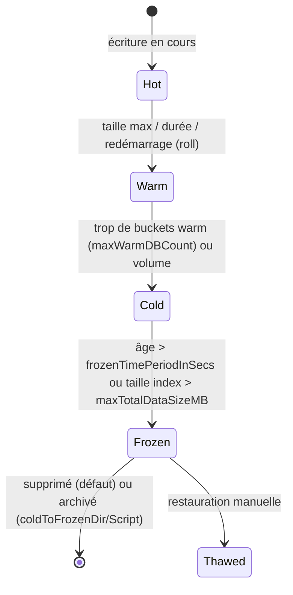

# 02 — Splunk de zéro : les fondamentaux

## 1. Qu'est-ce que Splunk ?

Splunk est une plateforme qui **ingère n'importe quelle donnée machine** (logs, métriques,
événements), l'**indexe par le temps**, et permet de la **rechercher / corréler / visualiser /
alerter** avec un langage : le **SPL** (Search Processing Language).

Dans un contexte **SIEM** (Security Information and Event Management), Splunk centralise les
logs de sécurité (pare-feu, AD, proxy, EDR...) pour le **SOC**, souvent avec l'app premium
**Splunk Enterprise Security (ES)** qui ajoute corrélation, notables, risk-based alerting, et
s'appuie sur le modèle de données **CIM** (Common Information Model).

**Principe clé : « schema on read »**. Splunk stocke le texte brut + un index des mots ; les
champs sont extraits **au moment de la recherche** (sauf quelques champs indexés : `_time`,
`host`, `source`, `sourcetype`, `index`). → On peut ingérer sans définir de schéma à l'avance.

## 2. Vocabulaire indispensable

| Terme | Définition |
|---|---|
| **Événement (event)** | Une unité de donnée (souvent une ligne de log) avec un horodatage `_time`. |
| **Index** | Répertoire logique de stockage (≈ une « base »). Porte la **rétention** et les **droits d'accès** (un rôle voit tel index). Ex. `netfw`, `osnix`, `wineventlog`. |
| **Métadonnées par défaut** | `host` (qui a produit), `source` (fichier/flux d'origine), `sourcetype` (**format** de la donnée → pilote le parsing), `index`. |
| **Sourcetype** | *La* notion clé : il détermine comment couper les événements, lire la date, extraire les champs. Ex. `cisco:asa`, `linux_secure`, `pan:traffic`. |
| **Bucket** | Répertoire physique d'un index contenant les données d'une plage de temps : `rawdata/journal.zst` (brut compressé) + fichiers `.tsidx` (index inversé). |
| **App** | Paquet (répertoire) de configurations : `default/`, `local/`, `metadata/`, `bin/`, `lookups/`. Tout dans Splunk est une app. |
| **Add-on (TA)** | App technique sans interface : parsing/extraction pour une techno (ex. `Splunk_TA_paloalto`). |
| **Knowledge objects** | Recherches sauvegardées, alertes, dashboards, lookups, macros, event types, tags, field extractions, data models. |
| **CIM** | Modèle de données normalisé (Authentication, Network_Traffic, Web...) pour corréler des sources hétérogènes. |

## 3. Cycle de vie d'un bucket



- **Hot** : seul état en écriture (`homePath`, disque rapide).
- **Warm** : lecture seule, même volume que hot (`homePath`).
- **Cold** : lecture seule, volume moins cher (`coldPath`).
- **Frozen** : sort de Splunk (suppression par défaut !).
- **Thawed** : données archivées ré-importées (`thawedPath`).

Exemple `indexes.conf` :

```ini
[netfw]
homePath   = volume:hot/netfw/db
coldPath   = volume:cold/netfw/colddb
thawedPath = $SPLUNK_DB/netfw/thaweddb
# 365 jours
frozenTimePeriodInSecs = 31536000
maxTotalDataSizeMB     = 500000
# OBLIGATOIRE pour répliquer dans un cluster
repFactor = auto
```

> ⚠️ **Piège classique** : les fichiers `.conf` Splunk **n'acceptent pas les commentaires en fin
> de ligne**. `repFactor = auto  # commentaire` donne la valeur `auto  # commentaire` → erreur.
> Un commentaire = une ligne qui commence par `#`.

## 4. Le pipeline d'ingestion (où se passe quoi)


- **Où se fait le parsing ?** Sur le **premier Splunk « complet »** traversé : l'**indexeur**
  ou le **heavy forwarder**. L'**UF ne parse pas** (sauf données structurées `INDEXED_EXTRACTIONS`).
- Conséquence importante : les `props.conf`/`transforms.conf` *index-time* (LINE_BREAKER,
  TIME_FORMAT, TRANSFORMS) doivent être déployés **sur les indexeurs/HF**, alors que les
  extractions *search-time* (EXTRACT, REPORT, FIELDALIAS, EVAL, LOOKUP) vont **sur les search heads**.
  → C'est pourquoi un TA est souvent déployé **sur les deux** tiers.
- **HEC endpoint `/services/collector/event`** : l'événement arrive déjà découpé (pas de line breaking), `/raw` passe par le parsing complet.

### Les « 6 magiques » d'un bon `props.conf`
```ini
[mon:sourcetype]
SHOULD_LINEMERGE = false
LINE_BREAKER = ([\r\n]+)
TIME_PREFIX = ^
TIME_FORMAT = %Y-%m-%dT%H:%M:%S.%3N%z
MAX_TIMESTAMP_LOOKAHEAD = 30
TRUNCATE = 10000
```

## 5. Les fichiers `.conf` et la précédence

Tout Splunk se configure dans `$SPLUNK_HOME/etc/` (défaut `/opt/splunk/etc`).

| Fichier | Rôle |
|---|---|
| `inputs.conf` | Ce qu'on collecte (monitor, tcp, udp, http/HEC, splunktcp 9997) |
| `outputs.conf` | Où on envoie (forwarders → indexeurs) |
| `props.conf` / `transforms.conf` | Parsing, extractions, routage |
| `indexes.conf` | Définition des index, volumes, rétention |
| `server.conf` | Identité, clustering, SHC, KV store, SSL, pass4SymmKey |
| `authentication.conf` / `authorize.conf` | LDAP/SAML, rôles et droits sur les index |
| `serverclass.conf` | Server classes du Deployment Server |
| `savedsearches.conf` | Recherches planifiées / alertes |
| `web.conf` | Splunk Web (port, SSL) |
| `limits.conf` | Limites de recherche, quotas |
| `distsearch.conf` | Search peers (recherche distribuée) |
| `deploymentclient.conf` | Client d'un DS |

**Règle d'or : on ne modifie jamais `default/`, toujours `local/`** (dans une app).

**Précédence (contexte global / index-time)** — du plus fort au plus faible :
1. `etc/system/local`
2. `etc/apps/<app>/local` (entre apps : ordre lexicographique du nom de répertoire, `A` l'emporte sur `Z`, majuscules avant minuscules)
3. `etc/apps/<app>/default`
4. `etc/system/default`

(En contexte *search-time*, c'est l'app de l'utilisateur qui prime, puis les autres apps.)
Sur un peer de cluster, `etc/peer-apps` (ex-`slave-apps`) a la priorité la plus haute après `system/local`.

**L'outil qui sauve : `btool`**
```bash
/opt/splunk/bin/splunk btool inputs list --debug     # conf effective + fichier d'origine
/opt/splunk/bin/splunk btool props list pan:traffic --debug
/opt/splunk/bin/splunk btool check                   # détecte les erreurs de syntaxe
```

**Bonne pratique d'industrialisation** : ne **rien** mettre dans `system/local` (sauf
l'identité du nœud), tout mettre dans des **apps nommées et versionnées** (`org_all_indexes`,
`org_all_forwarder_outputs`, `org_cluster_indexer_base`...) → c'est ce que contient
[`splunk-apps/`](../splunk-apps/).

## 6. Les rôles d'une instance Splunk

Le **même binaire** Splunk Enterprise joue tous les rôles ; c'est la **configuration** qui
détermine le rôle (sauf l'UF, qui est un paquet séparé, plus léger).

| Rôle | Ce qui le définit |
|---|---|
| Indexeur | `inputs.conf [splunktcp://9997]`, `indexes.conf`, `server.conf [clustering] mode=peer` |
| Cluster Manager | `server.conf [clustering] mode=manager` |
| Search Head | `server.conf [clustering] mode=searchhead` + `[shclustering]` |
| Deployer | `server.conf [shclustering] pass4SymmKey + shcluster_label` |
| Deployment Server | présence de `serverclass.conf` |
| License Manager | licences installées ; les autres ont `[license] manager_uri = https://lm:8089` |
| Heavy Forwarder | `outputs.conf` + `indexAndForward=false` |

## 7. Le SPL en 10 minutes

```spl
# Recherche de base : index + filtre + période
index=osnix sourcetype=linux_secure "Failed password" earliest=-24h

# Compter par champ
index=osnix "Failed password" | stats count by src, user | sort -count

# Timechart
index=netfw action=blocked | timechart span=5m count by dest_port limit=10

# Extraction regex à la volée
index=osnix "Failed password" | rex "from (?<src_ip>\d+\.\d+\.\d+\.\d+)" | top src_ip

# Enrichissement avec lookup
index=netfw | lookup asset_inventory ip AS src OUTPUT owner, criticality

# Recherche très rapide sur métadonnées indexées (tstats)
| tstats count where index=* by index, sourcetype

# Événements par index sur 1h (vérifier l'ingestion)
| tstats count where index=* earliest=-1h by index _time span=5m

# Recherche interne (supervision)
index=_internal sourcetype=splunkd log_level=ERROR | stats count by component
```

**Pipeline** : les commandes s'enchaînent avec `|` comme en shell. Les commandes
*streaming* (`eval`, `rex`, `where`) s'exécutent sur les indexeurs ; les commandes
*transforming* (`stats`, `timechart`) finissent sur le search head.

**Performance** : toujours préciser `index=` + plage de temps, filtrer tôt, préférer `tstats`
et les *data models accélérés*.

## 8. Index internes (à connaître pour le MCO)

| Index | Contenu |
|---|---|
| `_internal` | Logs de Splunk lui-même (`splunkd.log`, `metrics.log`, `license_usage.log`, `scheduler.log`) |
| `_introspection` | Ressources (CPU, RAM, disque) par processus |
| `_audit` | Qui a fait quoi (logins, recherches) |
| `_telemetry`, `_configtracker` | Télémétrie, suivi des modifications de conf (9.x) |
| `_metrics` | Métriques internes |

## 9. Pratique : premier Splunk standalone (30 min)

```bash
# VM Rocky/Alma/Ubuntu, 2 vCPU / 4 Go
sudo useradd -m -r splunk
sudo tar -xzf splunk-9.*-Linux-x86_64.tgz -C /opt
sudo tee /opt/splunk/etc/system/local/user-seed.conf <<'EOF'
[user_info]
USERNAME = admin
PASSWORD = ChangeMe123!
EOF
sudo chown -R splunk:splunk /opt/splunk
sudo -u splunk /opt/splunk/bin/splunk start --accept-license --answer-yes --no-prompt
sudo /opt/splunk/bin/splunk enable boot-start -user splunk -systemd-managed 1

# Créer un index et monitorer un fichier
sudo -u splunk /opt/splunk/bin/splunk add index lab -auth admin:ChangeMe123!
sudo -u splunk /opt/splunk/bin/splunk add monitor /var/log/secure -index lab -sourcetype linux_secure
# (Ubuntu : /var/log/auth.log)

# Activer HEC et créer un token
sudo -u splunk /opt/splunk/bin/splunk http-event-collector enable -uri https://localhost:8089 -auth admin:ChangeMe123!
sudo -u splunk /opt/splunk/bin/splunk http-event-collector create lab-token -uri https://localhost:8089 -index lab -auth admin:ChangeMe123!
curl -k https://localhost:8088/services/collector/event \
  -H "Authorization: Splunk <TOKEN>" -d '{"event":"hello splunk","sourcetype":"test"}'
```

Puis dans http://VM:8000 : `index=lab`. Explorer **Settings → Indexes / Data inputs /
Forwarding and receiving / Licensing**, et le **Monitoring Console**.

> ⚠️ **Licence** : la licence *Free* (500 Mo/j) **ne permet pas le clustering** ni
> l'authentification. Le téléchargement inclut une **licence Trial Enterprise de 60 jours**
> (500 Mo/j) : elle suffit pour le lab. En cluster, installe-la sur le License Manager.
