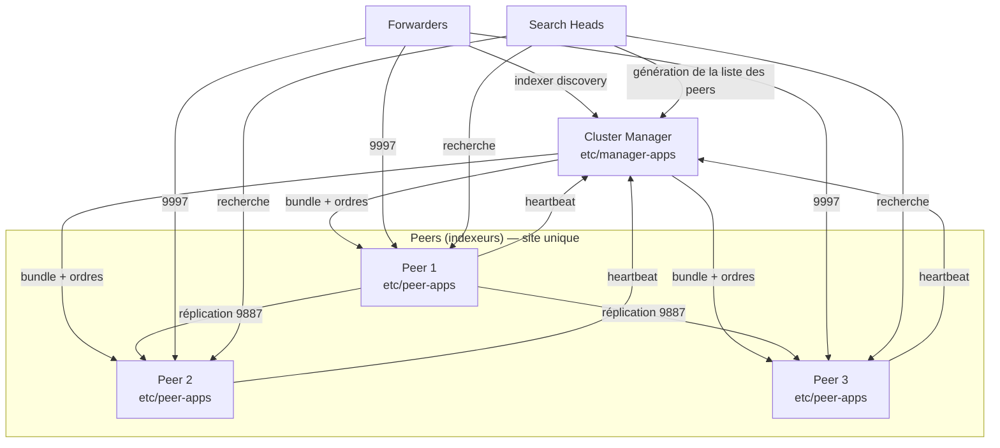
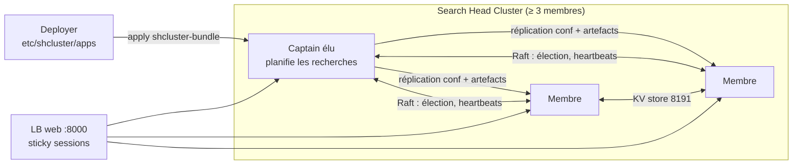

# 03 — Clustering Splunk : indexer cluster & search head cluster

## 1. Indexer cluster : les concepts



| Notion | Explication |
|---|---|
| **Replication Factor (RF)** | Nombre total de **copies** de chaque bucket dans le cluster. RF=3 → on tolère la perte de RF-1 = 2 peers sans perdre de données. |
| **Search Factor (SF)** | Nombre de copies **recherchables** (avec fichiers `.tsidx`). Les autres copies n'ont que le `rawdata` (moins de disque, mais il faut reconstruire les tsidx en cas de besoin). SF ≤ RF. |
| **Primary copy** | Pour chaque bucket, une seule copie recherchable est « primaire » : c'est elle qui répond aux recherches (pas de doublons). |
| **Generation** | Numéro que le CM incrémente quand la répartition des primaires change ; les SH l'utilisent pour savoir quelles copies interroger. |
| **Bucket fixup** | Quand un peer tombe, le CM ordonne de recréer les copies manquantes (réplication + « search factor fixup »). |
| **Valid / Complete** | Cluster *valid* = SF respecté (toutes les données sont recherchables) ; *complete* = RF + SF respectés. |
| **Multisite** | Cluster réparti sur plusieurs sites/DC : `site_replication_factor = origin:2,total:3`, `site_search_factor = origin:1,total:2`, *search affinity* (un SH interroge en priorité son site). |
| **pass4SymmKey** | Secret partagé qui authentifie CM ↔ peers ↔ SH. **À stocker dans Vault.** |
| **Configuration bundle** | Contenu de `etc/manager-apps` sur le CM, poussé à l'identique vers `etc/peer-apps` de chaque peer. **Toute conf des indexeurs passe par là.** |

### Pourquoi RF=3 / SF=2 est le standard ?
Perte d'1 peer → toujours 2 copies dont au moins 1 recherchable, le cluster reste
*valid*, le CM recrée les copies. Coût disque ≈ `volume/jour × 0,15 × RF + volume/jour × 0,35 × SF`.

## 2. Mise en place d'un indexer cluster (CLI)

```bash
# --- Sur le Cluster Manager ---
splunk edit cluster-config -mode manager \
  -replication_factor 3 -search_factor 2 \
  -secret '<pass4SymmKey>' -cluster_label lab_cluster -auth admin:<pwd>
splunk restart

# --- Sur chaque indexeur (peer) ---
splunk edit cluster-config -mode peer -manager_uri https://cm01:8089 \
  -replication_port 9887 -secret '<pass4SymmKey>' -auth admin:<pwd>
splunk restart

# --- Sur chaque search head (hors SHC ou membre du SHC) ---
splunk edit cluster-config -mode searchhead -manager_uri https://cm01:8089 \
  -secret '<pass4SymmKey>' -auth admin:<pwd>
```

Résultat dans `server.conf` (ce qu'Ansible écrit directement dans le lab) :
```ini
# CM
[clustering]
mode = manager
replication_factor = 3
search_factor = 2
pass4SymmKey = <chiffré au démarrage>
cluster_label = lab_cluster

# Peer
[replication_port://9887]

[clustering]
mode = peer
manager_uri = https://cm01:8089
pass4SymmKey = ...
```

> Le mot de passe en clair écrit dans un `.conf` est **chiffré par splunkd au démarrage**
> avec `etc/auth/splunk.secret`. Conséquence : `splunk.secret` doit être identique sur les
> nœuds si on veut copier des conf chiffrées d'un nœud à l'autre.

## 3. Le configuration bundle : LA procédure clé

```bash
# 1. Déposer / modifier l'app dans etc/manager-apps/ du CM (via Ansible, depuis Artifactory)
# 2. Valider
splunk validate cluster-bundle --check-restart -auth admin:<pwd>
splunk show cluster-bundle-status -auth admin:<pwd>
# 3. Appliquer (les peers redémarrent en "rolling" si nécessaire)
splunk apply cluster-bundle --answer-yes -auth admin:<pwd>
# 4. Suivre
splunk show cluster-bundle-status
# 5. Rollback si besoin
splunk rollback cluster-bundle
```

Ce qu'on met dans `manager-apps` : `indexes.conf` (avec `repFactor = auto`), `inputs.conf`
(splunktcp 9997, HEC), les TA avec props/transforms index-time, `outputs`/`server` communs.

L'app spéciale `manager-apps/_cluster/local/` existe aussi, mais la bonne pratique est de
créer ses **propres apps** versionnées.

## 4. Opérations courantes sur l'indexer cluster

| Besoin | Commande |
|---|---|
| État du cluster | `splunk show cluster-status --verbose` (sur le CM) |
| Maintenance (suspend le fixup) | `splunk enable maintenance-mode` / `disable` / `show maintenance-mode` |
| Arrêt propre d'un peer (temporaire) | `splunk offline` (sur le peer) |
| Décommission définitive | `splunk offline --enforce-counts` (attend que RF/SF soit rétabli ailleurs), puis `splunk remove cluster-peers -peers <GUID>` sur le CM |
| Redémarrage progressif | `splunk rolling-restart cluster-peers [-searchable true]` |
| Rééquilibrer les données | `splunk rebalance cluster-data -action start` |
| Rééquilibrer les primaires | `splunk rebalance cluster-primaries` |
| Upgrade | `splunk upgrade-init cluster-peers` → pour chaque peer `splunk offline`, mise à jour, `splunk start` → `splunk upgrade-finalize cluster-peers` |

Tout est aussi visible dans l'UI du CM : **Settings → Indexer Clustering**.

## 5. Search Head Cluster (SHC)



| Notion | Explication |
|---|---|
| **Captain** | Membre élu dynamiquement (consensus Raft, **majorité requise** → 3 membres minimum, nombre impair conseillé). Il répartit les recherches planifiées, coordonne la réplication. |
| **Réplication de conf** | Les modifications faites via l'UI (dashboards, recherches des utilisateurs) sont répliquées entre membres automatiquement. |
| **Réplication d'artefacts** | Les résultats de recherches planifiées sont répliqués (`replication_factor` du SHC, défaut 3). |
| **KV store** | Base MongoDB répliquée (port 8191) : lookups KV, état ES... |
| **Deployer** | Seule manière propre de déployer des apps sur le SHC. **Pas membre** du SHC. Un deployer par SHC. |
| **Static captain** | Mode dégradé si perte de majorité (DR) : on désigne manuellement un captain. |

### Création d'un SHC (CLI)
```bash
# Sur le Deployer : server.conf
# [shclustering]
# pass4SymmKey = <shc_secret>
# shcluster_label = lab_shc

# Sur chaque membre
splunk init shcluster-config -auth admin:<pwd> \
  -mgmt_uri https://sh01:8089 -replication_port 9200 -replication_factor 3 \
  -conf_deploy_fetch_url https://deployer01:8089 \
  -secret '<shc_secret>' -shcluster_label lab_shc
splunk restart

# Sur UN membre : élire le premier captain
splunk bootstrap shcluster-captain \
  -servers_list "https://sh01:8089,https://sh02:8089,https://sh03:8089" -auth admin:<pwd>

# Vérifier
splunk show shcluster-status --verbose
splunk show kvstore-status
```

Puis rattacher le SHC au cluster d'indexeurs : `splunk edit cluster-config -mode searchhead ...` sur chaque membre.

### Déployer sur le SHC
```bash
# Sur le Deployer, apps dans etc/shcluster/apps/
splunk apply shcluster-bundle -target https://sh01:8089 --answer-yes -auth admin:<pwd>
```
Modes de push (`deployer_push_mode` dans `app.conf`) : `merge_to_default` (défaut : `local` fusionné dans
`default`), `full`, `local_only`, `default_only`.

### Opérations SHC
| Besoin | Commande |
|---|---|
| Rolling restart | `splunk rolling-restart shcluster-members` |
| Transférer le captain | `splunk transfer shcluster-captain -mgmt_uri https://sh02:8089` |
| Resync d'un membre désynchronisé | `splunk resync shcluster-replicated-config` |
| Sortir un membre | `splunk remove shcluster-member` |
| Maintenance KV store | `splunk show kvstore-status`, `splunk clean kvstore --local` (+ resync) |

## 6. Les autres rôles de management

### Deployment Server
```ini
# etc/system/local/serverclass.conf (sur le DS)
[global]
restartSplunkd = false

[serverClass:linux_servers]
whitelist.0 = *lnx*

[serverClass:linux_servers:app:org_all_forwarder_outputs]
restartSplunkd = true

[serverClass:linux_servers:app:org_linux_inputs]
restartSplunkd = true
```
```bash
# Côté UF
splunk set deploy-poll ds01:8089
# Côté DS après modification
splunk reload deploy-server
```
Apps dans `etc/deployment-apps/`.

### License Manager
```bash
splunk add licenses /tmp/Splunk.License        # sur le LM
splunk edit licenser-localpeer -manager_uri https://lm01:8089   # sur les autres
```

### Monitoring Console
Sur une instance dédiée (ou le CM en petit env) : **Settings → Monitoring Console → Settings → General Setup → Distributed mode**,
ajouter toutes les instances comme *search peers* (`splunk add search-server`), attribuer les rôles, activer les alertes de plateforme.

## 7. Co-localisation des rôles (ce qui est autorisé)

| Combinaison | Autorisée ? |
|---|---|
| CM + License Manager + MC | ✅ courant en petit/moyen env |
| Deployer + Deployment Server | ✅ (petit nombre de clients) |
| Deployer + CM | ⚠️ possible mais déconseillé |
| CM sur un peer | ❌ |
| Deployer membre du SHC | ❌ |
| DS avec > 50 clients sur un SH/IDX | ❌ (DS dédié) |

## 8. Ordre de démarrage / mise à jour

1. **License Manager**, **Cluster Manager** (mode maintenance activé)
2. **Search Heads** (SHC : rolling upgrade membre par membre, deployer aussi)
3. **Indexeurs** (rolling, `splunk offline` un par un)
4. **Deployment Server**, **Heavy Forwarders**, puis **Universal Forwarders**

Règle : le CM doit être en version **≥** celle des peers et des SH ; les forwarders peuvent
rester en version plus ancienne (matrice de compatibilité).
