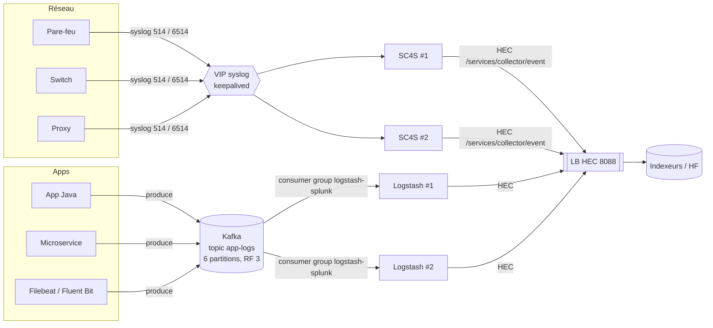

# 04 — Chaîne d'ingestion : Syslog, SC4S, Kafka, Logstash, HEC

## 1. Vue d'ensemble



## 2. Syslog en 5 minutes

- Format RFC 3164 (BSD, ancien) : `<PRI>Mmm dd hh:mm:ss HOST TAG: message`
- Format RFC 5424 : `<PRI>1 2024-01-01T12:00:00Z HOST APP PROCID MSGID [SD] message`
- `PRI = facility × 8 + severity` (ex. `<134>` = local0.info).
- **UDP 514** : sans accusé de réception → perte possible, pas de contrôle de flux, mais universel.
- **TCP 514/601** : fiable (au niveau transport). **TLS 6514** : chiffré.
- Problèmes classiques : horodatage sans année/fuseau, hostname absent, messages tronqués
  (MTU en UDP), multi-ligne.

**Anti-pattern** : envoyer du syslog directement sur un port UDP d'un indexeur Splunk → perte
à chaque redémarrage, pas de répartition de charge. D'où **SC4S** (ou rsyslog/syslog-ng + UF).

## 3. SC4S (Splunk Connect for Syslog)

- Image conteneur officielle : `ghcr.io/splunk/splunk-connect-for-syslog/container3:<version>`
- Lancé via **systemd + podman** (ou docker), config via un fichier d'environnement
  `/opt/sc4s/env_file` et des répertoires montés (`/opt/sc4s/local`, `/opt/sc4s/archive`, `/opt/sc4s/tls`).
- Pour chaque message : identification de la source → **sourcetype + index** (valeurs par défaut
  CIM-friendly) → envoi **HEC** (batch, gzip, multiples workers).
- **Buffer disque** (*disk buffer* syslog-ng) si HEC indisponible : `/var/lib/syslog-ng` (volume `splunk-sc4s-var`).
- **Supervision** : SC4S envoie ses propres métriques en HEC (index `_metrics` / `em_metrics`) et un événement de démarrage (`index=main sourcetype=sc4s:events` avec la version).

### Configuration minimale (`/opt/sc4s/env_file`)
```bash
SC4S_DEST_SPLUNK_HEC_DEFAULT_URL=https://hec-lb.lab.local:8088
SC4S_DEST_SPLUNK_HEC_DEFAULT_TOKEN=<token HEC depuis Vault>
SC4S_DEST_SPLUNK_HEC_DEFAULT_TLS_VERIFY=no    # "yes" en prod avec CA
# Port dédié pour une source qui n'a pas d'en-tête reconnaissable
SC4S_LISTEN_CISCO_ASA_UDP_PORT=5140
```

### Index attendus par SC4S (à créer dans Splunk !)
`email, epav, epintel, fireeye, gitops, infraops, netauth, netdlp, netdns, netfw, netids,
netipam, netlb, netops, netwaf, netproxy, netservices, oswin, oswinsec, osnix, print, _metrics`
(voir [`splunk-apps/manager-apps/org_all_indexes`](../splunk-apps/manager-apps/org_all_indexes/local/indexes.conf)).

Si l'index n'existe pas → événements rejetés par HEC (erreur « Incorrect index ») ou redirigés vers
un *lastChanceIndex* si configuré.

### Personnalisation
- `/opt/sc4s/local/context/splunk_metadata.csv` : surcharger index/sourcetype par clé (`cisco_asa,index,netfw_asa`).
- `/opt/sc4s/local/context/vendor_product_by_source.csv` + `.conf` : associer une IP/un host à un produit.
- `/opt/sc4s/local/config/app_parsers/` : parsers syslog-ng personnalisés.

### Commandes utiles
```bash
systemctl status sc4s
podman logs SC4S
podman exec -it SC4S syslog-ng-ctl stats
echo "<134>$(date '+%b %d %H:%M:%S') testhost myapp: hello sc4s" | nc -u -w1 sc4s01 514
```
Dans Splunk : `index=* sourcetype=sc4s:*` / `index=main sourcetype="sc4s:events"`.

## 4. Kafka en 10 minutes

| Notion | Définition |
|---|---|
| **Broker** | Serveur Kafka. Un cluster = plusieurs brokers (3 min. en prod). |
| **Topic** | Flux nommé de messages (ex. `app-logs`). |
| **Partition** | Découpage d'un topic : unité de parallélisme et d'ordre. |
| **Réplication** | Chaque partition a un *leader* et des *followers* (`replication.factor=3`, `min.insync.replicas=2`). |
| **Producer** | Écrit dans un topic (`acks=all` pour la durabilité). |
| **Consumer group** | Ensemble de consommateurs se partageant les partitions : **1 partition = 1 consommateur max du groupe** → nb de partitions = parallélisme max. |
| **Offset** | Position de lecture, commitée par le groupe → reprise après crash. |
| **Lag** | Retard = dernier offset produit − offset commité. **KPI n°1 à superviser.** |
| **Rétention** | Durée/volume de conservation (`retention.ms`), indépendante de la consommation → tampon et *replay*. |
| **KRaft** | Mode sans Zookeeper (Kafka ≥ 3.3, obligatoire en 4.x) : quorum de controllers intégré. |
| **Sécurité** | TLS (9093), authentification SASL (SCRAM, Kerberos) ou mTLS, ACL par topic. |

```bash
kafka-topics.sh --bootstrap-server kafka01:9092 --create --topic app-logs --partitions 6 --replication-factor 1
kafka-console-producer.sh --bootstrap-server kafka01:9092 --topic app-logs
kafka-consumer-groups.sh --bootstrap-server kafka01:9092 --describe --group logstash-splunk   # voir le LAG
```

**Alternative à Logstash** : *Splunk Connect for Kafka* (connecteur Kafka Connect *sink* vers HEC).
Logstash est préféré quand il y a de la **transformation** / multi-sorties.

## 5. Logstash

### Architecture
```
input { kafka {...} }   →   filter { json / grok / mutate / date / drop }   →   output { http {...} }
          ↑ queue (mémoire ou persistante sur disque) ↑           workers × batch
```
- `/etc/logstash/logstash.yml` : réglages globaux (`queue.type: persisted`, `pipeline.workers`, `pipeline.batch.size`).
- `/etc/logstash/pipelines.yml` : **plusieurs pipelines isolés** dans la même JVM (un par flux / par source).
- `/etc/logstash/conf.d/*.conf` : définition des pipelines.
- **Keystore** Logstash : stocke les secrets (`${HEC_TOKEN}`) → alimenté par Ansible depuis Vault.
- **JVM** : `/etc/logstash/jvm.options` (`-Xms/-Xmx` identiques, ≤ 50 % RAM).
- **Monitoring** : API `http://localhost:9600/_node/stats/pipelines?pretty` (events in/out, durée des filtres, queue).
- **Dead Letter Queue** : pour les événements rejetés (surtout avec l'output Elasticsearch).

### Pipeline Kafka → Splunk HEC (version simplifiée ; version complète : [`ingestion/logstash/pipeline/kafka-to-splunk.conf`](../ingestion/logstash/pipeline/kafka-to-splunk.conf))
```ruby
input {
  kafka {
    bootstrap_servers => "kafka01:9092"
    topics            => ["app-logs"]
    group_id          => "logstash-splunk"
    consumer_threads  => 3
    codec             => "json"
  }
}
filter {
  date   { match => ["timestamp", "ISO8601"] target => "@timestamp" }
  if [level] == "DEBUG" { drop {} }            # réduction du volume de licence
  mutate { remove_field => ["@version"] }
}
output {
  http {
    url         => "https://hec-lb:8088/services/collector/event"
    http_method => "post"
    format      => "json"
    headers     => { "Authorization" => "Splunk ${HEC_TOKEN}" }
    mapping     => {
      "time"       => "%{+%s}"   # epoch
      "host"       => "%{[host]}"
      "sourcetype" => "app:json"
      "index"      => "app"
      "event"      => "%{message}"
    }
  }
}
```

### Pièges classiques
- HEC attend **un objet JSON par événement** (ou des objets concaténés), pas un tableau JSON → attention à `format => json_batch`.
- Le champ `time` HEC est en **epoch secondes** (décimal accepté).
- Si Splunk renvoie des 503 (*server busy*, queues pleines), Logstash réessaie → le lag Kafka augmente : c'est normal et sain (pas de perte).
- Une modification de pipeline se recharge à chaud si `config.reload.automatic: true`, sinon `systemctl restart logstash`.

## 6. HEC (HTTP Event Collector)

- Activé dans `inputs.conf` : `[http] disabled = 0, port = 8088, enableSSL = 1`.
- **Token** = GUID associé à un index par défaut + liste d'index autorisés (`indexes = ...`) + sourcetype.
- Endpoints : `/services/collector/event` (JSON), `/services/collector/raw` (texte brut, parsé), `/services/collector/health` (pour le LB).
- **Indexer acknowledgement** (`useACK = true`) : le client récupère un ackId et interroge `/services/collector/ack` pour avoir la garantie d'écriture (utilisé par SC4S optionnellement, par Kinesis/Firehose...).
- **En cluster** : le token doit être **identique sur tous les indexeurs** → défini dans une app de `manager-apps` (le token n'est pas créé via l'UI).
- Codes retour : `0 Success`, `400 Invalid data format`, `403 Invalid token`, `503 Server busy`.

```bash
curl -k https://hec-lb:8088/services/collector/health
curl -k https://hec-lb:8088/services/collector/event -H "Authorization: Splunk $TOKEN" \
  -d '{"event":{"msg":"test"},"index":"app","sourcetype":"app:json"}'
```

## 7. Haute disponibilité de la chaîne

| Maillon | Comment on le rend HA |
|---|---|
| Réception syslog | 2+ SC4S derrière une **VIP keepalived** ou un LB L4 (attention : UDP + LB = perte de l'IP source si SNAT) |
| SC4S → Splunk | Disk buffer + plusieurs URL HEC / LB |
| Kafka | 3 brokers, RF=3, `min.insync.replicas=2` |
| Logstash | Plusieurs instances dans le même consumer group, queue persistante |
| HEC | LB avec health-check `/services/collector/health` vers tous les indexeurs |
| Indexeurs | Cluster RF/SF |

## 8. Superviser la chaîne (MCO « pipelines Logstash »)

| Point de mesure | Indicateur | Où |
|---|---|---|
| SC4S | événements reçus / envoyés, erreurs HEC, taille du buffer | `index=_metrics` (métriques SC4S), `podman logs` |
| Kafka | **consumer lag** du groupe Logstash, ISR réduits, espace disque | `kafka-consumer-groups.sh`, JMX / Prometheus |
| Logstash | events in/out par pipeline, durée filtres, queue, JVM heap | API 9600, Metricbeat, ou script → HEC |
| HEC | erreurs 4xx/5xx, rejets de token | `index=_internal sourcetype=splunkd component=HttpInputDataHandler` |
| Splunk | queues pleines (`blocked=true`), latence d'indexation `_indextime - _time` | MC → Indexing Performance |

```spl
index=_internal source=*metrics.log group=queue blocked=true
| stats count by host, name

index=app earliest=-15m | eval lag=_indextime-_time | stats avg(lag) max(lag) by sourcetype
```
