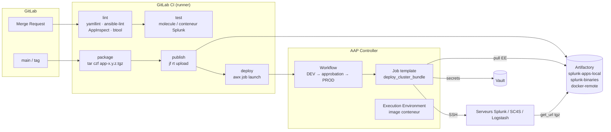

# 05 — CI/CD : Git, GitLab CI, Artifactory, AAP (Ansible), HashiCorp Vault

## 1. Le principe : « tout est code »

| Ce qu'on versionne | Dépôt Git type |
|---|---|
| Rôles et playbooks Ansible | `splunk-ansible` |
| Inventaires par environnement (dev, rec, prod) | `splunk-inventories` (ou dans le même repo) |
| Apps Splunk (indexes, inputs, TA, dashboards) | `splunk-apps` |
| Pipelines Logstash, conf SC4S | `logging-pipelines` |
| Objets AAP (job templates, workflows) | `aap-config` (collection `ansible.controller` / `infra.aap_configuration`) |

**Flux Git** : branche de feature → *merge request* (revue + pipeline CI) → merge sur `main` →
déploiement auto en DEV → promotion manuelle (bouton) en REC puis PROD. Les versions sont des **tags** (`v1.4.0`).

## 2. La chaîne complète



## 3. Ansible : l'essentiel à maîtriser

| Notion | À savoir |
|---|---|
| **Inventaire** | Groupes (`cluster_manager`, `indexers`, `search_heads`...), variables `group_vars/` / `host_vars/`. Un inventaire par environnement. |
| **Playbook** | Liste de *plays* : hôtes ciblés + rôles/tâches. |
| **Rôle** | Structure réutilisable : `tasks/`, `handlers/`, `templates/`, `defaults/`, `vars/`, `files/`, `meta/`. |
| **Idempotence** | Rejouer = même résultat, `changed=0` au 2ᵉ passage. Utiliser les modules (`template`, `lineinfile`, `ini_file`) plutôt que `shell`. Pour `command`, utiliser `creates:` / `changed_when:`. |
| **Handlers** | Déclenchés par `notify` si changement → ex. redémarrer splunkd **une seule fois** en fin de play. |
| **`serial`** | Traiter les hôtes par lots → **rolling restart** / rolling upgrade (`serial: 1`). |
| **`delegate_to` / `run_once`** | Exécuter une action sur le CM pendant qu'on traite les indexeurs (ex. activer le maintenance mode). |
| **Tags** | Exécuter une partie seulement (`--tags sc4s`). |
| **Check / diff** | `--check --diff` : simuler et voir les changements avant la prod. |
| **Collections** | `community.hashi_vault`, `ansible.posix`, `community.general`, `containers.podman`, `ansible.controller`. Stockées en local dans Artifactory/Automation Hub. |
| **Ansible Vault** (≠ HashiCorp Vault !) | Chiffrement de fichiers de variables dans Git. Utilisé en dépannage ; en entreprise on préfère HashiCorp Vault. |

Le rôle officiel **`splunk/splunk-ansible`** (utilisé par l'image Docker Splunk) existe ; beaucoup
d'équipes ont leurs propres rôles plus simples, comme dans [`ansible/roles`](../ansible/roles).

## 4. AAP (Ansible Automation Platform) / AWX

AWX = projet open source amont ; **AAP** = produit Red Hat supporté (Controller + Automation Hub
+ Execution Environments + Event-Driven Ansible + Platform Gateway en 2.5).

| Objet AAP | Rôle |
|---|---|
| **Organization / Team / User** | Multi-tenant, RBAC |
| **Project** | Lien vers un dépôt Git (synchronisé) contenant les playbooks |
| **Inventory** | Statique, dynamique (plugin vSphere/Proxmox/ServiceNow), ou depuis un fichier du projet (*inventory source*) |
| **Credential** | Machine (clé SSH), Source Control, Vault, **HashiCorp Vault Secret Lookup**, Artifactory (custom credential type)... Les secrets ne sont jamais visibles des utilisateurs. |
| **Execution Environment (EE)** | Image conteneur contenant ansible-core + collections + libs Python (`ansible-builder`). Stockée dans un registry (Artifactory/Automation Hub). |
| **Job Template** | Playbook + inventaire + credentials + variables + *survey* (formulaire). |
| **Workflow Job Template** | Enchaînement de job templates avec conditions succès/échec et **nœuds d'approbation**. |
| **Schedule** | Planification (ex. contrôle de conformité nocturne). |
| **Notification** | Mail/Slack/Teams/webhook sur succès/échec. |
| **API REST** | `/api/v2/job_templates/<id>/launch/` → c'est ce qu'appelle la CI. |

Lancement depuis la CI :
```bash
curl -s -X POST -H "Authorization: Bearer $AAP_TOKEN" -H "Content-Type: application/json" \
  https://aap.lab.local/api/v2/job_templates/12/launch/ \
  -d '{"extra_vars":{"app_name":"org_all_indexes","app_version":"1.4.0","target_env":"rec"}}'
# ou : awx job_templates launch 12 --extra_vars '{...}' --monitor
```

### Intégration AAP ↔ HashiCorp Vault
1. Créer un credential de type **HashiCorp Vault Secret Lookup** (URL `https://vault:8200`, auth **AppRole** : role_id + secret_id, ou token).
2. Dans le credential *Machine* (ou un credential custom *Splunk admin*), pour le champ mot de passe, cliquer sur la clé 🔑 → « source = credential Vault », chemin `secret/data/splunk/prod`, clé `admin_password`.
3. Au lancement du job, AAP va chercher la valeur, l'injecte (variable d'env, extra_var ou fichier) **sans jamais la stocker**.

Alternative côté playbook : lookup `community.hashi_vault` (utilisé dans le lab) :
```yaml
splunk_admin_password: "{{ lookup('community.hashi_vault.vault_kv2_get', 'splunk/lab', engine_mount_point='secret').secret.admin_password }}"
```

## 5. HashiCorp Vault

| Notion | Définition |
|---|---|
| **Seal / Unseal** | Au démarrage, Vault est *scellé* : il faut N clés sur M (Shamir) ou l'**auto-unseal** (KMS/HSM/Transit) pour déchiffrer la clé maître. |
| **Storage** | Stockage intégré **Raft** (cluster 3/5 nœuds) ou Consul. |
| **Secrets engines** | **KV v2** (secrets statiques versionnés), **PKI** (émettre des certificats TLS pour Splunk/HEC/syslog TLS), **SSH** (certificats SSH signés), **Database** (identifiants dynamiques), **Transit** (chiffrement as a service). |
| **Auth methods** | **AppRole** (machines/AAP), LDAP/OIDC (humains), Kubernetes, JWT (GitLab CI : `CI_JOB_JWT` / `id_tokens`), token. |
| **Policies** | HCL : quels chemins, quelles capacités (`read`, `create`, `update`, `list`...). Principe du moindre privilège. |
| **Token / TTL / lease** | Tout accès se fait par un token à durée de vie limitée, renouvelable, révocable. |
| **Audit device** | Journal de toutes les requêtes (à envoyer dans Splunk !). |

```bash
vault secrets enable -path=secret kv-v2
vault kv put secret/splunk/lab admin_password='S3cr3t!' idxc_pass4symmkey='idxcKey' shc_pass4symmkey='shcKey' hec_token='<uuid>'
vault kv get -field=hec_token secret/splunk/lab

vault policy write ansible-splunk - <<EOF
path "secret/data/splunk/*" { capabilities = ["read"] }
EOF
vault auth enable approle
vault write auth/approle/role/aap token_policies=ansible-splunk token_ttl=1h secret_id_ttl=24h
vault read  auth/approle/role/aap/role-id
vault write -f auth/approle/role/aap/secret-id

# PKI : certificat pour le HEC
vault secrets enable pki && vault secrets tune -max-lease-ttl=87600h pki
vault write pki/root/generate/internal common_name=lab.local ttl=87600h
vault write pki/roles/splunk allowed_domains=lab.local allow_subdomains=true max_ttl=720h
vault write pki/issue/splunk common_name=idx01.lab.local
```

**Ce qu'on met dans Vault dans cette mission** : mot de passe `admin` Splunk (par env), `pass4SymmKey`
(indexer cluster, SHC, general), tokens HEC (SC4S, Logstash), `splunk.secret`, compte de service LDAP,
certificats TLS (PKI), token API AAP pour la CI, identifiants Artifactory, identifiants Kafka SASL.

## 6. Artifactory

| Notion | Définition |
|---|---|
| **Local repository** | Artefacts produits en interne (apps Splunk `.tgz`, binaires Splunk téléchargés, EE). |
| **Remote repository** | Proxy/cache d'un dépôt public (Docker Hub, ghcr.io, PyPI, Galaxy, dépôts RPM). |
| **Virtual repository** | Agrège local + remote derrière une seule URL. |
| **Types** | Generic, Docker, PyPI, RPM/YUM, Ansible (versions récentes)... |
| **Propriétés / build info** | Métadonnées sur l'artefact (commit, pipeline) → traçabilité. |
| **Promotion** | Déplacer/copier un artefact de `-dev` vers `-release` après validation. |

```bash
# Upload (CI)
curl -u "$ART_USER:$ART_TOKEN" -T org_all_indexes-1.4.0.tgz \
  "https://artifactory.lab.local/artifactory/splunk-apps-local/org_all_indexes/1.4.0/org_all_indexes-1.4.0.tgz"
# ou JFrog CLI :
jf rt upload "dist/*.tgz" splunk-apps-local/ --flat=false
# Download (Ansible)
- ansible.builtin.get_url:
    url: "{{ artifactory_url }}/splunk-binaries/splunk-{{ splunk_version }}-Linux-x86_64.tgz"
    headers: { Authorization: "Bearer {{ artifactory_token }}" }
    dest: /tmp/
    checksum: "sha256:{{ splunk_sha256 }}"
```

Alternative légère pour le lab : **Nexus OSS** ou même **Artifactory OSS** en conteneur (voir lab).

## 7. Le pipeline GitLab CI de référence

Voir [`cicd/gitlab/.gitlab-ci.yml`](../cicd/gitlab/.gitlab-ci.yml). Étapes :
1. **lint** : `yamllint`, `ansible-lint`, vérification `.conf` (`splunk btool check` dans un conteneur `splunk/splunk`), **AppInspect** (`splunk-appinspect inspect app.tgz --mode precert`).
2. **package** : `tar czf` de chaque app modifiée, versionnée avec le tag Git.
3. **publish** : upload Artifactory.
4. **deploy-dev** (auto) → **deploy-rec** (manuel) → **deploy-prod** (manuel + protégé) : appel API AAP.

Secrets de la CI : récupérés dans Vault via **JWT GitLab** (`id_tokens:` + `secrets:vault`) → pas de variable
CI en clair.

## 8. Questions « piège » CI/CD
- *Pourquoi AAP et pas juste `ansible-playbook` dans la CI ?* → RBAC, audit, credentials protégés, EE standardisés,
  workflows avec approbation, exécution depuis une zone réseau autorisée à SSH vers la prod, réutilisable par l'exploitation hors CI.
- *Comment faire un rollback ?* → redéployer la version N-1 depuis Artifactory (artefact immuable), ou `splunk rollback cluster-bundle`.
- *Comment tester un playbook ?* → `--check --diff`, Molecule (conteneurs), environnement DEV, `ansible-lint`.
- *Comment gérer les différences entre environnements ?* → mêmes rôles, inventaires/`group_vars` différents, secrets Vault par chemin d'environnement (`secret/splunk/dev`, `secret/splunk/prod`).
